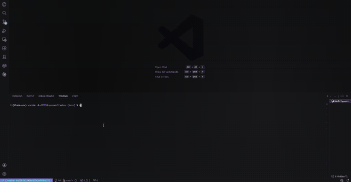
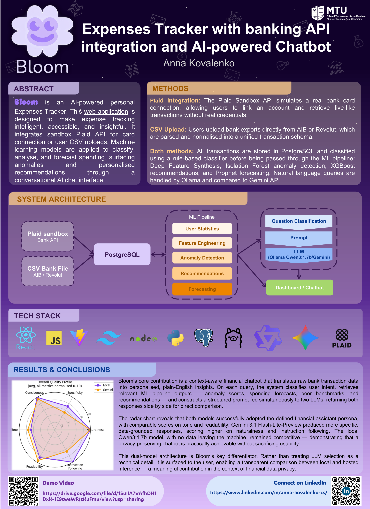
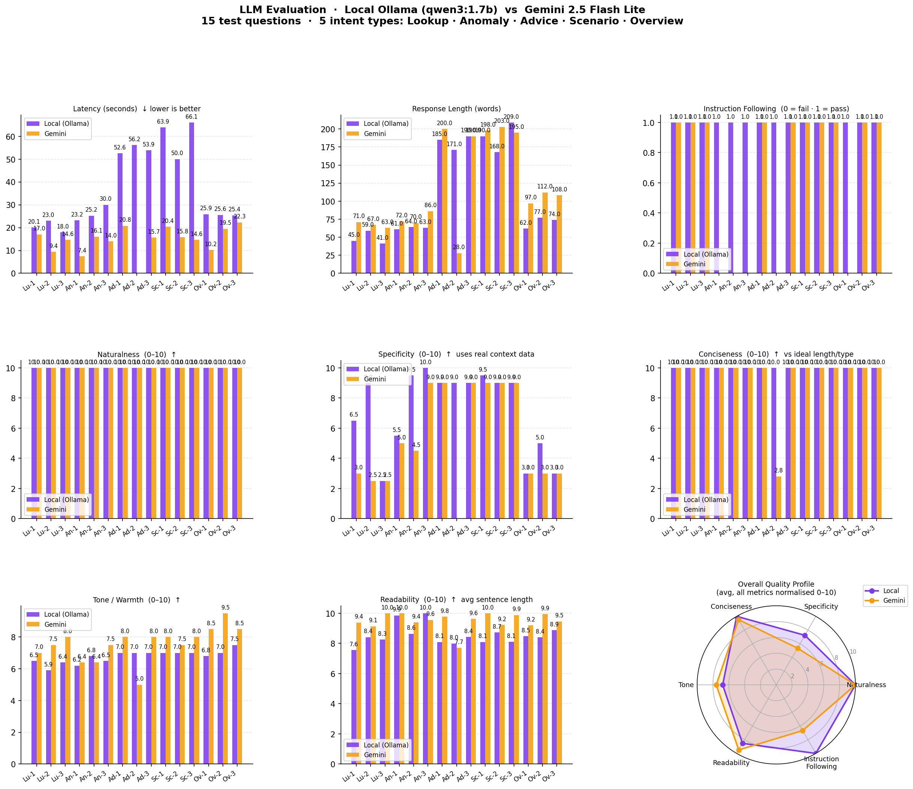

# 🌸 Bloom — AI-Powered Expenses Tracker

> Final Year Project | BSc (Hons) Computing | Munster Technological University Kerry | Anna Kovalenko

**Bloom** is an AI-powered personal expenses tracker that connects to bank accounts via the Plaid sandbox API or accepts CSV exports from AIB and Revolut. Transactions are passed through a machine learning pipeline and surfaced as personalised insights through a conversational chatbot — with responses generated simultaneously by a local LLM and a cloud-hosted one, displayed side by side.

---

## Demo



> Full demo video: [Google Drive](https://drive.google.com/file/d/1SuIIA7VAfhDH1DxX-1E9tweWRJzKuFmu/view?usp=sharing)

---

## Poster



---

## How It Works

### 1. Data Ingestion

Transactions enter the system through one of two paths. The **Plaid Sandbox API** simulates a real bank connection, returning structured transaction data without requiring real credentials. Alternatively, users can upload a **CSV export from AIB or Revolut**, which the backend parses and normalises into a unified transaction schema before storing everything in PostgreSQL.

### 2. ML Pipeline

Once stored, transactions are processed through a sequential ML pipeline:

- **Deep Feature Synthesis** — automatically engineers features from raw transaction data, capturing patterns like spending velocity, merchant frequency, and category ratios
- **Isolation Forest** — an unsupervised anomaly detection model that flags transactions that deviate significantly from a user's established spending behaviour
- **XGBoost** — generates personalised spending recommendations based on categorised transaction history and engineered features
- **Prophet** — a time-series forecasting model that predicts future spending trends from historical patterns

The outputs of each stage — anomaly scores, forecasts, category breakdowns, and recommendations — are stored and made available to the chatbot layer.

### 3. Dual-LLM Chatbot

The chatbot is Bloom's core contribution. When a user submits a natural language query, the system first **classifies the intent** of the question to determine which ML pipeline outputs are relevant. It then retrieves the appropriate data — anomaly flags, forecast values, peer benchmarks, or recommendations — and constructs a structured prompt that is sent **simultaneously** to two LLMs:

- **Ollama (Qwen3:1.7b)** — runs entirely locally, with no data leaving the machine
- **Gemini 1.5 Flash-Lite** — a hosted cloud model via the Gemini API

Both responses are displayed side by side in the UI, allowing direct comparison between local and cloud inference. This dual-model architecture is deliberate: it surfaces LLM selection as a transparent design choice rather than a hidden technical detail, which is particularly meaningful in the context of financial data privacy.

Both models were evaluated across 15 test questions covering 5 intent types — Lookup, Anomaly, Advice, Scenario, and Overview — scored across 6 quality metrics.

**Specificity** was the sharpest differentiator. Gemini consistently grounded its responses in the actual transaction data, scoring 9–10 across most intent types. Qwen3 struggled notably on Lookup and Anomaly queries, where it produced more generic responses rather than citing specific figures from the context (scores as low as 2.5–3.0 on some questions).

**Naturalness, Readability, and Instruction Following** were near-identical between the two models — both scoring 9–10 across the board — showing that the local model matches the cloud model on fluency and adherence to the defined financial assistant persona.

**Tone and Conciseness** were also close, though Qwen3 occasionally produced more verbose responses (up to 200 words vs Gemini's 168 on some questions) and slightly lower warmth scores on conversational queries.

**Latency** was the most significant practical tradeoff. Qwen3 running locally was consistently slower — peaking at 63–66 seconds on Scenario and Overview questions — while Gemini responded in under 25 seconds across all question types. For simpler Lookup queries both models responded in under 25 seconds.



The radar chart confirms the overall picture: both models score comparably on tone, naturalness, readability, and instruction following, while Gemini edges ahead on specificity and conciseness. The key finding is that Qwen3's quality gap is narrow enough that a fully local, privacy-preserving deployment is practically viable — at the cost of latency on complex queries.

---

## System Architecture

```
Data Sources          Storage        ML Pipeline            Chatbot
─────────────         ───────        ──────────────         ────────────────────────
Plaid Sandbox  ──┐                   Feature Engineering    Intent Classification
                 ├──▶ PostgreSQL ──▶ Anomaly Detection  ──▶ Prompt Construction
CSV (AIB/      ──┘                   Recommendations        ├──▶ Ollama (local)
 Revolut)                            Forecasting            └──▶ Gemini (cloud)
                                                            Dashboard / Chat UI
```

---

## Tech Stack

| Layer | Technology |
|---|---|
| Frontend | React, TypeScript |
| Backend | Python, FastAPI |
| Database | PostgreSQL |
| ML Pipeline | Deep Feature Synthesis, Isolation Forest, XGBoost, Prophet |
| LLMs | Ollama (Qwen3:1.7b) · Gemini 1.5 Flash-Lite |
| Bank Integration | Plaid Sandbox API |

---

## Author

**Anna Kovalenko** · [LinkedIn](https://www.linkedin.com/in/anna-kovalenko-cs/)
